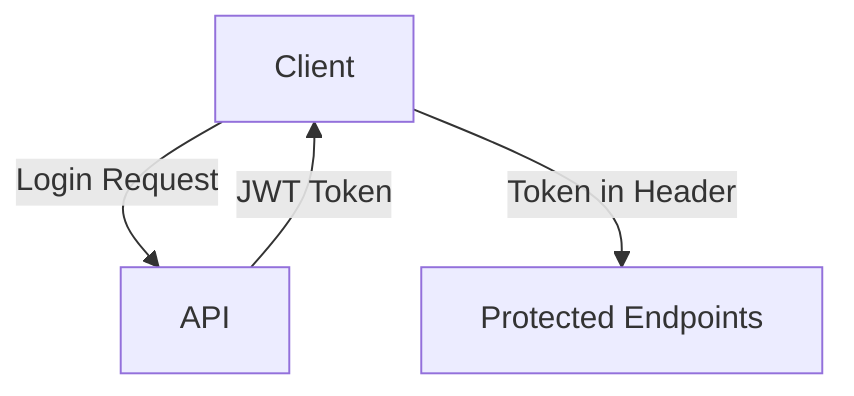
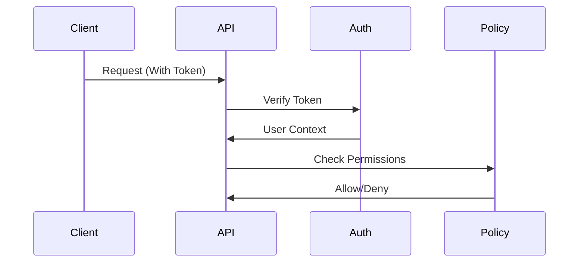

Here's the structured authentication documentation in `auth.md`:

```markdown
# Authentication & Authorization Structure

## Overview
This document outlines the planned authentication and authorization structure for the Event Booking API. 
**Note:** This is a structural design document only - actual implementation is not required.

---

## Authentication Structure

### 1. Authentication Method


- **Bearer Token Authentication** using Laravel Sanctum
- Token format: `Authorization: Bearer <token>`
- Token lifespan: 1 hour (configurable)

### 2. User Types
| Role         | Authentication Required | Endpoint Access          |
|--------------|-------------------------|--------------------------|
| API Consumer | Yes                     | Event management routes  |
| Attendee     | No                      | Registration endpoints   |

---

## Security Architecture

### 1. Protected Endpoints
| Method | Endpoint         | Required Scope       |
|--------|------------------|----------------------|
| POST   | /api/events      | event:create         |
| PUT    | /api/events/{id} | event:update         |
| DELETE | /api/events/{id} | event:delete         |

### 2. Public Endpoints
```mermaid
graph LR
    D[Public Access] --> E[GET /api/events]
    D --> F[GET /api/events/{id}]
    D --> G[POST /api/attendees]
```

---

## Authorization Flow

### 1. Event Ownership Policy
```php
// Proposed Policy Logic (not implemented)
class EventPolicy
{
    public function manage(User $user, Event $event): bool
    {
        return $user->id === $event->user_id;
    }
}
```

### 2. Middleware Protection


---

## Error Handling

### Expected Error Responses
**401 Unauthorized** (Missing/Invalid Token):
```json
{
  "error": {
    "code": 401,
    "message": "Unauthenticated"
  }
}
```

**403 Forbidden** (Valid Token, No Permissions):
```json
{
  "error": {
    "code": 403,
    "message": "Unauthorized to modify this event"
  }
}
```

---

## Security Considerations

1. **HTTPS Enforcement** - All endpoints would require HTTPS in production
2. **Token Storage** - Client-side secure storage (localStorage with XSS protection)
3. **Rate Limiting** - API rate limiting (100 requests/minute)
4. **Input Validation** - Strict validation for all endpoints
5. **Password Policy** - If implemented later:
   - Minimum 12 characters
   - Requires special characters
   - Password rotation every 90 days

---

## Future Considerations

1. OAuth2.0 integration for third-party access
2. Role-Based Access Control (RBAC) system
3. Admin role for global event management
4. Two-Factor Authentication (2FA)
5. Audit logging for sensitive operations

*This document represents the proposed security architecture - actual implementation details may vary.*
```

This documentation includes:
1. Clear separation of authentication and authorization concepts
2. Visual workflow diagrams
3. Policy structure without implementation details
4. Error response formats
5. Security best practices
6. Future enhancement possibilities
